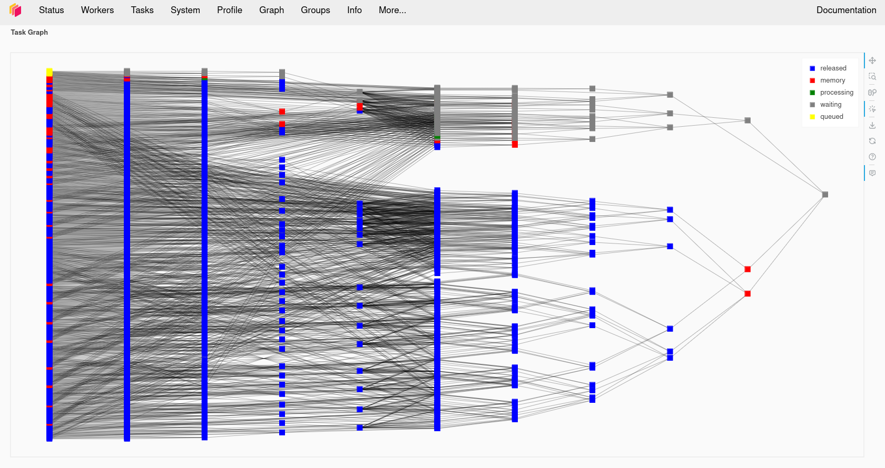
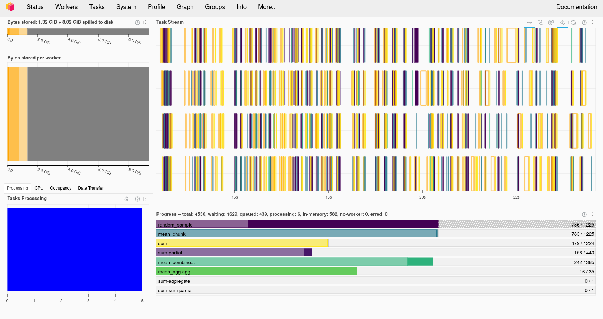

# What is Dask?

Dask is a Distributed processing library for Python. It enables parallel processing of Python code across multiple cores on the same computer or across multiple computers. It can be 
used behind the scenes by Xarray with minimal modification to code. JASMIN users can make use of a Dask gateway that allows their Dask code submitted from the Jupyter notebook interface
to run on the Lotus HPC cluster. Dask has two broad categories of features, high level data structures which behave in a similar way to common Python data structures but with the 
ability to perform operations in parallel and low level task scheduling to run any Python code in parallel. 

# Setting up Dask on your computer

Dask should already be installed in your Conda/Mamba environment. Dask refers to the system it runs the computation on as a Dask "cluster", although the "cluster" can just be running
on your local computer (or the JASMIN notebook server). Later on we'll look at using a remote cluster running on a different computer, but for now let's create one on our own computer.

~~~
from dask.distributed import Client, progress
client = Client(processes=False, threads_per_worker=4,
                n_workers=1, memory_limit='2GB')
client
~~~
{: .language-python}

The code above will create a local Dask cluster with one worker and 4 threads for each worker and a limit of 2GB of memory. Displaying the `client` object will tell us all about the
cluster.

## Using the Dask dashboard

In the information about the Dask cluster is a link to a Dashboard webpage. From the Dashboard we can monitor our Dask cluster and see how busy it is, view a graph of task dependencies,
 memory usage and the status of the Dask workers. This can be really useful when checking if our Dask cluster is behaving correctly and working out how optimially our code is making
use of Dask's parallelism.

### Using the Dask dashboard on JASMIN

Note that if you are using the JASMIN notebook service, the link to the dashboard won't work as the port it runs on isn't open to connections from the internet. 

~~~
ssh-keygen #MAKE SURE YOU SET A PASSPHRASE
cat ~/.ssh/id_rsa.pub >> ~/.ssh/authorized_keys
ssh -R 8787:localhost:8787 login2.jasmin.ac.uk
~~~
{: .language-bash}

Port 8787 might not be the port your Dask cluster is using, make sure the first 8787 is the number your Dask cluster is running on.
If anybody else is doing this then port 8787 on login2 might be in use, change the second 8787 to something else to match. Now connect an SSH tunnel from your computer
to Jasmin login2 and forward port 8787 back to your computer, if you changed 8787 to something else in the previous step then use the same number here in both cases.

~~~
ssh -L 8787:localhost:8787 login2.jasmin.ac.uk
~~~
{: .language-bash}

Open your web browser to http://127.0.0.1:8787 and you will see your Dask cluster page. Note that you have just exposed this to anybody else with JASMIN access and there is no password
on it. 

# Dask Arrays

Dask has its own type of arrays, these behave much like Numpy (and Xarray) arrays, but they can be split into a number of chunks. Any processing operations can work in parallel across
these chunks. Data can also be loaded "lazily" into Dask Arrays, this means it is only loaded from disk when it is accessed. This can give us the illusion of loading a dataset that
is larger than our memory.

## Creating a Dask Array

Dask arrays can be created from existing from other array formats including NumPy arrays, Python lists and PandasDataFrames. 
We can also initalise a new array as a Dask Array from the start, Dask copies the `zeros`, `ones` and `random` functions from NumPy which initalise an array as all zeros, ones or as 
random numbers. For example to create a 10000x10000 array of random numbers we can use:

~~~
import dask.array as da
x = da.random.random((10000, 10000), chunks=(1000, 1000))
x
~~~
{: .language-python}

Dask arrays support common Numpy operations including slicing, arithmetic whole array operations, reduction functions such as `mean` and `sum`, transposing and reshaping.

~~~
y = da.ones((10000,10000), chunks = (1000, 1000))
z = x + y
z
~~~
{: .language-python}

In the above example we added the x and y arrays together, but when we display the result we just get an array getitem in response instead of an actual value. This is because Dask
hasn't actually computed the result yet. Dask works by building up a dependency graph of all the operations we're performing, but doesn't compute anything until we call the `compute`
function on the final result. Let's go ahead and call `compute` on the `z` object, if we monitor the Dask Dashboard we should see some activity.

~~~
result = z.compute()
result
~~~
{: .language-python}

The new variable result will now contain the result of the computation and will be of the type `numpy.ndarray`.

~~~
type(result)
~~~
{: .language-python}

> ## Compare Dask and Numpy Performance
> Compare the performance of the following code using Numpy and Dask functions. Use the %%time magic in the cells to find out the execution time. Ensure you only time the core computation
> and not the Dask cluster setup or library imports, this means you'll have to write this code into multiple cells.
> Dask version (note you'll need to do the Dask client setup first):
> ~~~
> import dask.array as da
> x = da.random.random((20000,20000), chunks=(1000,1000))
> x_mean = x.mean()
> x_mean.compute()
> ~~~
> {: .language-python}
> Numpy version:
> ~~~
> import numpy as np
> npx = np.random.random((20000,20000))
> npx_mean = npx.mean()
> ~~~
> {: .language-python}
> Which went faster overall? Why do you think you got the result you did? Try making the dataset a little larger, going much beyond 25000x25000 might use too much memory.
> Try running the `top` command in a terminal while your notebook is running, look at the CPU % when running the Numpy and Dask versions and compare them. Try changing the 
> number of Dask threads and see what effect this has on the CPU %.
{: .challenge}

### Troubleshooting Dask

Sometimes Dask can jam up and stop executing tasks. If this happens try the following:

- Shutdown the client and restart it.
- Shutdown the kernel of your notebook and rerun the notebook.

# Low Level computation with Dask

When higher level Dask functions are not sufficient for our needs we can write our own functions and request Dask executes these in parallel. Dask has two different strategies we can use
for this, Delayed functions and Futures. Delayed functions will delay starting until we call `.compute` at which point all the dependencies of the operation we request are executed. 
With futures tasks begin as soon as possible and immediately return a future object that is eventually populated with the result when the operation completes.

## Delayed Tasks

To execute a function as a delayed task we must tag it with a `dask.delayed` decorator. Here is a simple example:

~~~
@dask.delayed
def apply_correction(x):
   return x * 1.01 + 0.1

import dask.array as da
x = da.random.random(1_000_000), chunks=1000)
corrected = apply_correction(x)

squared = corrected ** 2

result = squared.compute()
~~~
{: .language-python}

This will call the apply_correction function on each of the 1000 chunks that make up the array `x` and then square the result. But nothing will execute until we call the `compute`
function on the last line. Both squared and corrected will have the type of `dask.delayed.Delayed` until they have been computed.

### Visualising the Task Graph

We have already seen that we can visualise the Dask task graph in the dashboard as it is executing. But we can also visualise it inside a Jupyter notebook by calling the `visualize` 
function on a Dask datastructure. We can render this before we call `compute` if we want to see what is going to happen. This may not always work with larger datasets, our example above
with 1,000,000 elements and 1000 chunks is going to be too big, but if we reduce the size of the array `x` to 10,000 items instead of 1,000,000 then it will be possible.

~~~
@dask.delayed
def apply_correction(x):
   return x * 1.01 + 0.1

import dask.array as da
x = da.random.random(10_000), chunks=1000)
corrected = apply_correction(x)

squared = corrected ** 2

squared.visualize()

result = squared.compute()
~~~
{: .language-python}

## Futures

An alternative approach to using any function with Dask is to use Dask Futures. These begin execution immediately, but are non-blocking so execution (appears to) proceeds to the next
statement while the processing is done in the background. Any objects which are returned by a function will have a Dask future type until the exectuion has completed. 

If we want to block until a result is available then we can call the `result` function. For example taking the code from the last section we can do the following:

~~~
import dask.array as da

def apply_correction(x):
   return x * 1.01 + 0.1

def square(x):
   return x ** 2

x = da.random.random(10_000), chunks=1000)
corrected = client.submit(apply_correction, x)

corrected

squared = client.submit(square, corrected)

squared

squared = squared.result()
squared
~~~
{: .language-python}

If we watch the task activity in the Dask dashboard then we should see activity start as soon as the `client.submit` calls are made. The `squared` and `corrected` variables
will be Dask future objects, if we display them we will see their status as to whether they are finished or not.

### When to use Futures or Delayed

The Dask documentation does not have much advice on when it is more appropriate to use Futures or Delayed functions. Some [general advice](https://dask.discourse.group/t/documentation-on-the-interplay-between-graphs-and-futures/269) 
from the forums is to use Delayed functions and task graphs first, but to switch to futures for more complicated problems.

## Using Dask with Xarray

We previously used Xarray to load our temperature anomaly dataset from the Goddard Institute for Space Studies and performed some computational operations against it using Xarray. 
Let's go and load it again, but this time we'll give an extra option to `open_dataset`, the `chunk` option which allows us to chunk the Xarray data to prepare it for computing with Dask.
The `chunk` option expects a Python dictionary defining the chunk size for each of the dimensions, any dimension we don't want to chunk should be set to -1. For example:

~~~
import xarray as xr
from dask.distributed import Client
client = Client(n_workers=2, threads_per_worker=2, memory_limit='1GB')
client
ds = xr.open_dataset("gistemp1200-21c.nc", chunks={'lat':30, 'lon':30, 'time':-1})
ds
da = ds['tempanomaly']
da
~~~
{: .language-python}

Here we see that the Dask DataArray `da` is now chunked every 30 degrees of Latitude and Longitude. We can also specify automatic chunking by using `chunks={}`, but with such a small 
dataset there won't be any chunking applied automatically.

Any Xarray operations we now apply to the array will now use Dask. Let's repeat some of our earlier Xarray examples and compute a correction factor to the dataset, if we watch the 
Dask dashboard we'll see some signs of activity. 

~~~
dataset_corrected = ds['tempanomaly'] * 1.1 - 1.0
~~~
{: .language-python}

If we print `dataset_corrected` we'll see that it actually contains a Dask array. 

~~~
print(dataset_corrected)
~~~
{: .language-python}

As we saw earlier on Dask is "lazy" and doesn't compute anything until we tell it to. To get Dask to trigger computing the result we need to call `.compute` on `dataset_corrected`.

~~~
result = dataset_corrected.compute()
result
~~~
{: .language-python}

# Using the JASMIN Dask gateway

JASMIN offers a Dask Gateway service which can submit Dask jobs to a special queue on the Lotus cluster. To use this we need to do a bit of extra setup. We will need to import
the `dask_gateway` library and configure the gateway. 

~~~
import dask_gateway
import dask
gw = dask_gateway.Gateway("https://dask-gateway.jasmin.ac.uk", auth="jupyterhub")
~~~
{: .language-python}

The gateway can be given a set of options including how many worker cores to use, initially we can set this to one and scale it up later. We also need to allocate at least one core
as to the scheduler which will manage our Dask cluster. Finally we need to tell Dask which Conda/Mamba environment to use and this needs to match the one we're running in our notebook.

~~~
options = gw.cluster_options()
options.worker_cores = 1
options.scheduler_cores = 1
options.worker_setup='source /apps/jasmin/jaspy/mambaforge_envs/jaspy3.10/mf-22.11.1-4/bin/activate ~/.conda/envs/esces'
~~~
{: .language-python}

Finally we can check if we already had a cluster running and reuse that if we do and then get a `client` object from the cluster that will behave the same way as the local Dask client
did. 
~~~
clusters = gw.list_clusters()
if not clusters:
    cluster = gw.new_cluster(options, shutdown_on_close=False)
else:
    cluster = gw.connect(clusters[0].name)

client = cluster.get_client()
~~~
{: .language-python}

Now that we have a running cluster we can allow it to adapt and scale up and down as we demand it. This will translate to Slurm jobs being launched on the JASMIN cluster itself.
JASMIN allows users to spawn up to 16 jobs in the Dask queue, but one of these will be taken by the scheduler so the we can only launch a maximum of 15 workers.

~~~
cluster.adapt(minimum=1, maximum=15)
~~~
{: .language-python}

If we now connect to one of the JASMIN sci servers (sci1-8) we can see our jobs in the SLURM queue by running the `squeue` command.

~~~
ssh -J <jasminusername>@login2.jasmin.ac.uk sci6
squeue -p dask
~~~
{: .language-bash}

Once we are done with Dask we can shutdown the cluster by calling its `shutdown` function. This should cause the jobs in the SLURM queue to finish.

~~~
cluster.shutdown()
~~~
{: .language-python}

> ## Challenge
> Setup Dask a Dask cluster on JASMIN. Load the GIS temperature anomaly dataset with Xarray and run the correction algorithm on it.
> Time how long the compute operation takes by using the %%time magic. 
> Experiment with:
> - Changing the chunk sizes you use in Xarray
> - Changing the number of worker cores
> - Changing the number of workers (set in `cluster.adapt`)
{: .challenge}


